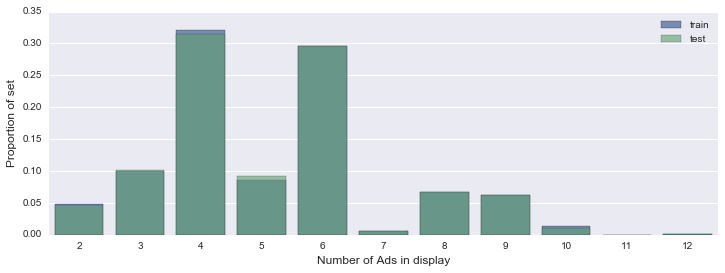
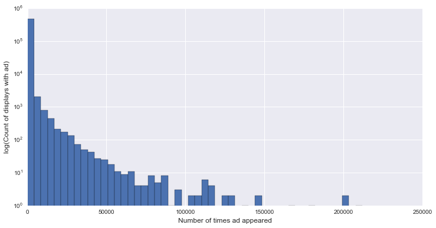
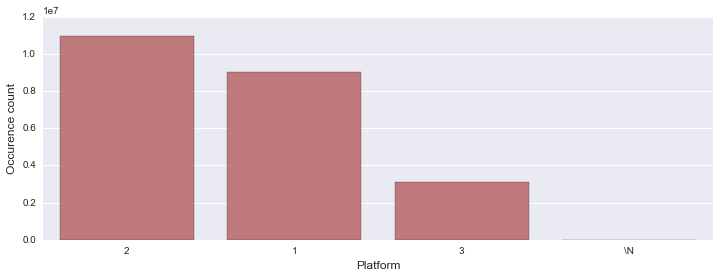
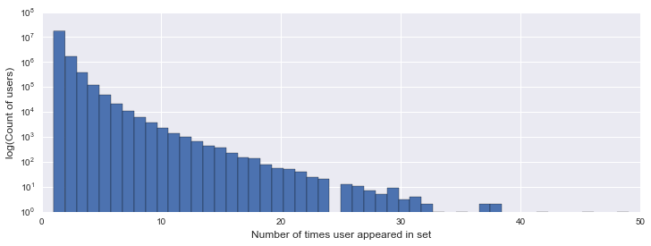
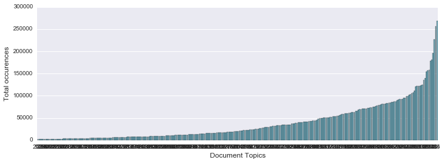
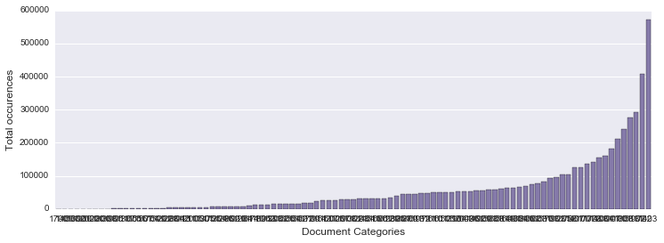

##Click Prediction

With 2 billion clicks over a span of a week, given by Outbrain. I proceed the project with exploratory data analysis. 

### Distribution of number of Ads on a Page


```python
import numpy as np
import pandas as pd
import matplotlib.pyplot as plt
import seaborn as sns
import gc
%matplotlib inline

p = sns.color_palette()

df_train = pd.read_csv('clicks_train.csv')
df_test = pd.read_csv('clicks_test.csv')

sizes_train = df_train.groupby('display_id')['ad_id'].count().value_counts()
sizes_test = df_test.groupby('display_id')['ad_id'].count().value_counts()
sizes_train = sizes_train / np.sum(sizes_train)
sizes_test = sizes_test / np.sum(sizes_test)

plt.figure(figsize=(12, 4))
sns.barplot(sizes_train.index, sizes_train.values, alpha=0.8, color=p[0], label='train')
sns.barplot(sizes_test.index, sizes_test.values, alpha=0.6, color=p[1], label='test')
plt.legend()
plt.xlabel('Number of Ads in display', fontsize=12)
plt.ylabel('Proportion of set', fontsize=12)
```


    <matplotlib.text.Text at 0x107ab25d0>





We can observe that there is always more than one advertisement on a single web page. Thus, it would be of our best interest to investigate whether or not certain advertisements are usually advertised together and how good different clusters of advertisements yield clicks. 

###Distribution of Number of Times ad Appeared


```python
ad_usage_train = df_train.groupby('ad_id')['ad_id'].count()

for i in [2, 10, 50, 100, 1000]:
    print('Ads that appear less than {} times: {}%'.format(i, round((ad_usage_train < i).mean() * 100, 2)))

plt.figure(figsize=(12, 6))
plt.hist(ad_usage_train.values, bins=50, log=True)
plt.xlabel('Number of times ad appeared', fontsize=12)
plt.ylabel('log(Count of displays with ad)', fontsize=12)
plt.show()
```

    Ads that appear less than 2 times: 22.69%
    Ads that appear less than 10 times: 61.74%
    Ads that appear less than 50 times: 86.93%
    Ads that appear less than 100 times: 91.04%
    Ads that appear less than 1000 times: 97.45%





We see that most ads (less than 3%) in the dataset are not repeated more than 1000 time. Thus, we must attempt to find a relationship between multiple advertisements to make predicitons. This is a promising idea because from output 9, there is always more than one advertisement on a web page. 


```python
ad_prop = len(set(df_test.ad_id.unique()).intersection(df_train.ad_id.unique())) / len(df_test.ad_id.unique())
print('Proportion of test ads in test that are in training: {}%'.format(round(ad_prop * 100, 2)))
```

    Proportion of test ads in test that are in training: 0.0%


Hi guys, this is 1.0 version of data analysis on this project. The above is buggy. Will fix asap!

### Training Set Data


```python
try:del df_train,df_test # Being nice to Azure
except:pass;gc.collect()

events = pd.read_csv('events.csv')
print('Shape:', events.shape)
print('Columns', events.columns.tolist())
events.head()
```

    /usr/local/lib/python2.7/site-packages/IPython/core/interactiveshell.py:2723: DtypeWarning: Columns (4) have mixed types. Specify dtype option on import or set low_memory=False.
      interactivity=interactivity, compiler=compiler, result=result)


    ('Shape:', (23120126, 6))
    ('Columns', ['display_id', 'uuid', 'document_id', 'timestamp', 'platform', 'geo_location'])


<div>
<table border="1" class="dataframe">
  <thead>
    <tr style="text-align: right;">
      <th></th>
      <th>display_id</th>
      <th>uuid</th>
      <th>document_id</th>
      <th>timestamp</th>
      <th>platform</th>
      <th>geo_location</th>
    </tr>
  </thead>
  <tbody>
    <tr>
      <th>0</th>
      <td>1</td>
      <td>cb8c55702adb93</td>
      <td>379743</td>
      <td>61</td>
      <td>3</td>
      <td>US&gt;SC&gt;519</td>
    </tr>
    <tr>
      <th>1</th>
      <td>2</td>
      <td>79a85fa78311b9</td>
      <td>1794259</td>
      <td>81</td>
      <td>2</td>
      <td>US&gt;CA&gt;807</td>
    </tr>
    <tr>
      <th>2</th>
      <td>3</td>
      <td>822932ce3d8757</td>
      <td>1179111</td>
      <td>182</td>
      <td>2</td>
      <td>US&gt;MI&gt;505</td>
    </tr>
    <tr>
      <th>3</th>
      <td>4</td>
      <td>85281d0a49f7ac</td>
      <td>1777797</td>
      <td>234</td>
      <td>2</td>
      <td>US&gt;WV&gt;564</td>
    </tr>
    <tr>
      <th>4</th>
      <td>5</td>
      <td>8d0daef4bf5b56</td>
      <td>252458</td>
      <td>338</td>
      <td>2</td>
      <td>SG&gt;00</td>
    </tr>
  </tbody>
</table>
</div>


Description of respective symbols

display_id: 
uuid: unique number of user 
document_id: the web page the click occured 
timestamp: relative to first, can add a scalar constant to find out actual time
platform: 1: computer, 2: phone, 3: tablet
geo_location: where did the click take place


```python
plat = events.platform.value_counts()

print(plat)
print('\nUnique values of platform:', events.platform.unique())

```

    2     10684579
    1      8747280
    3      3032907
    2       291699
    1       279988
    3        83668
    \N           5
    Name: platform, dtype: int64
    ('\nUnique values of platform:', array([3, 2, 1, '2', '1', '3', '\\N'], dtype=object))


I am actually curious why there are two sets for the platforms. Why did dataset have some as ints and strings for the same platform? I will do more research and report back. 


```python
events.platform = events.platform.astype(str)
plat = events.platform.value_counts()

plt.figure(figsize=(12,4))
sns.barplot(plat.index, plat.values, alpha=0.8, color=p[2])
plt.xlabel('Platform', fontsize=12)
plt.ylabel('Occurence count', fontsize=12)
```


    <matplotlib.text.Text at 0x10b077710>





### Distribution of Number of Times Users Appeared in the Set


```python
uuid_counts = events.groupby('uuid')['uuid'].count().sort_values()

print(uuid_counts.tail())

for i in [2, 5, 10]:
    print('Users that appear less than {} times: {}%'.format(i, round((uuid_counts < i).mean() * 100, 2)))
    
plt.figure(figsize=(12, 4))
plt.hist(uuid_counts.values, bins=50, log=True)
plt.xlabel('Number of times user appeared in set', fontsize=12)
plt.ylabel('log(Count of users)', fontsize=12)
plt.show()
```

    uuid
    ef7761dd22277c    38
    45d23867dbe3b3    38
    c0bd502c7a479f    42
    2759b057797f02    46
    b88553e3a2aa29    49
    Name: uuid, dtype: int64
    Users that appear less than 2 times: 88.42%
    Users that appear less than 5 times: 99.51%
    Users that appear less than 10 times: 99.96%





We observe from this distribution that most users do not appear more than 10 times in this dataset. If our algorithm makes decisions based on features that depend on a specific user, it will be a miniscual (10 or less) amount of data to work with. Thus, we must generalize and have an algorithm that makes decisions on similarities in advertisements and less on individual users. This, however does not mean that we should not include a feature that analyzes how users are similar to one another (this can allow more data to be used and give better results). 


```python
try:del events
except:pass;gc.collect()

topics = pd.read_csv('documents_topics.csv')
print('Columns:',topics.columns.tolist())
print('Number of unique topics:', len(topics.topic_id.unique()))

topics.head()
```

    ('Columns:', ['document_id', 'topic_id', 'confidence_level'])
    ('Number of unique topics:', 300)


<div>
<table border="1" class="dataframe">
  <thead>
    <tr style="text-align: right;">
      <th></th>
      <th>document_id</th>
      <th>topic_id</th>
      <th>confidence_level</th>
    </tr>
  </thead>
  <tbody>
    <tr>
      <th>0</th>
      <td>1595802</td>
      <td>140</td>
      <td>0.073113</td>
    </tr>
    <tr>
      <th>1</th>
      <td>1595802</td>
      <td>16</td>
      <td>0.059416</td>
    </tr>
    <tr>
      <th>2</th>
      <td>1595802</td>
      <td>143</td>
      <td>0.045421</td>
    </tr>
    <tr>
      <th>3</th>
      <td>1595802</td>
      <td>170</td>
      <td>0.038867</td>
    </tr>
    <tr>
      <th>4</th>
      <td>1524246</td>
      <td>113</td>
      <td>0.196450</td>
    </tr>
  </tbody>
</table>
</div>


```python
topic_ids = topics.groupby('topic_id')['confidence_level'].count().sort_values()

for i in [10000, 50000, 100000, 200000]:
    print('Number of topics that appear more than {} times: {}'
          .format(i, (topic_ids > i).sum()))

plt.figure(figsize=(12, 4))
sns.barplot(topic_ids.index, topic_ids.values, order=topic_ids.index, alpha=1, color=p[5])
plt.xlabel('Document Topics', fontsize=12)
plt.ylabel('Total occurences', fontsize=12)
plt.show()
```

    Number of topics that appear more than 10000 times: 201
    Number of topics that appear more than 50000 times: 86
    Number of topics that appear more than 100000 times: 22
    Number of topics that appear more than 200000 times: 3





```python
cat = pd.read_csv('documents_categories.csv')
print('Columns:', cat.columns.tolist())
print('Number of unique categories:', len(cat.category_id.unique()))

cat_ids = cat.groupby('category_id')['confidence_level'].count().sort_values()

for i in [1000, 10000, 50000, 100000]:
    print('Number of categories that appear more than {} times: {}'
          .format(i, (cat_ids > i).sum()))

plt.figure(figsize=(12, 4))
sns.barplot(cat_ids.index, cat_ids.values, order=cat_ids.index, alpha=1, color=p[3])
plt.xlabel('Document Categories', fontsize=12)
plt.ylabel('Total occurences', fontsize=12)
plt.show()
```

    ('Columns:', ['document_id', 'category_id', 'confidence_level'])
    ('Number of unique categories:', 97)
    Number of categories that appear more than 1000 times: 88
    Number of categories that appear more than 10000 times: 65
    Number of categories that appear more than 50000 times: 35
    Number of categories that appear more than 100000 times: 15





```python

```


```python

```
